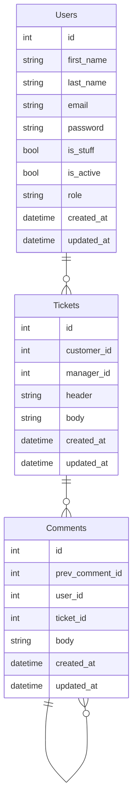

# Support service application


## Adjust the application


### Create `.env` file based on `.env.default`
```bash
# Unix
cp .env.default .env

# Windows
copy .env.default .env
```
### Install deps
```bash
pipenv sync --dev

# Activate the environment
pipenv shell
```

## Code quality tools
- flake8 6.0.0
- black 22.12.0
- isort 5.11.2

## Application description
```bash
▾ users
    ├─ apps.py # Django apps configuration
    ├─ urls.py # pre-controller
    ├─ api.py # Endpoints / post-controller
    ├─ models.py # Database tables mapper
    ├─ admin.py
```

# Database
