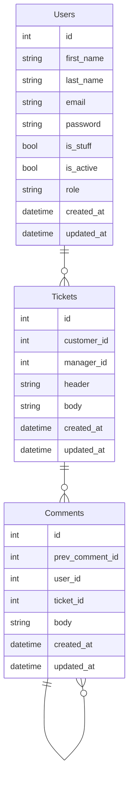

# Support service application

## Application description
```bash
▾ users
    ├─ apps.py # Django apps configuration
    ├─ urls.py # pre-controller
    ├─ api.py # Endpoints / post-controller
    ├─ models.py # Database tables mapper
    ├─ admin.py # Admin panel configuration
```

## Adjust the application


### Create `.env` file based on `.env.default`
```bash
# Unix
cp .env.default .env

# Windows
copy .env.default .env
```
### Install deps
```bash
pipenv sync --dev

# Activate the environment
pipenv shell
```

### Collect static files
```bash
# You 
python ./src/manage.py collectstatic 
```

### WSGI configuration
```bash
# Please note, that on windows system you currently unable to use gunicorn due to bug: https://github.com/lux-org/lux/issues/483
# Run using django WSGI
python ./src/manage.py runserver

# Run using gunicorn WSGI
gunicorn src.config.wsgi:application --bind localhost:8000

```
### Useful commands
```bash
# Build images
docker-compose build

# Stop containers
docker-compose down

# Check containers status
docker-compose ps

## Logs

# Get all logs
docker-compose logs

# Get specific logs
docker-compose logs app

# Get limited logs
docker-compose logs --tail 10 app

# Get flowed logs
docker-compose logs -f app
```

## Deploy application(AWS, GogleCloud, etc.)
After cloning repo to your hosting you need to fill .env file, run docker, create superuser, and you are ready to go:
```bash
cp .env.default .env
# fill the .env file
docker-compose build
docker-compose up -d
docker exec -it <your application  name(by default: support_app)> bash
python ./src/manage.py createsuperuser
```
## Code quality tools
- flake8 6.0.0
- black 22.12.0
- isort 5.11.2

## CI/CD


# Database
